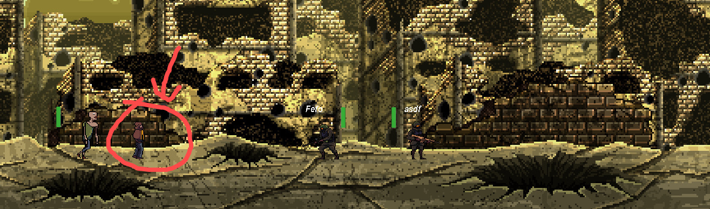
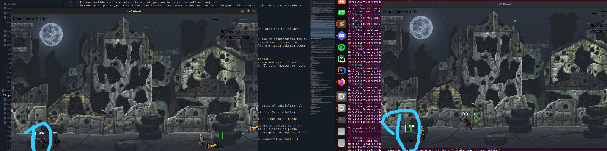

# Nota final: 8

# Documentación (3/5)
* El readme no tiene una consistencia de idioma, al principio está en inglés y después en castellano. Sean coherentes con el estilo.
* El manual tecnico se encuentra dividido en varios archivos separados donde algunos están en inglés, otros en castellano, los diagramas del server no están embebidos en la documentación. Se torna caótico de ver y tener un hilo de la documentación técnica.
* Al manual técnico le faltan algunos detalles de implementación, como está implementado el server, diagramas que expliquen lógica de juego, etc.
* No está el manual de proyecto.
* Lindo e informativo manual de usuario, le falta información sobre como "instalarlo" (o compilarlo si es que no tiene instalador), esa información quedó separada (y no actualizada dado que no está la información de dependencias de qt usadas, como qt5multimedia) en un documento aparte.

# UX/Jugabilidad (4/5)
* Mejoró mucho la jugabilidad, buen trabajo!
* La información del código para no joinearse la tenés que adivinar, falta mostrarla en
  pantalla para pasarselás a tus amigos cuando quieran unirse a la partida
* Al morir, se entra en un loop de reproducción de sonido de muerte infinito
* En una partida morí sin haber visto a ningún zombie cerca, y no estaba el venom para matarme 
  a distancia
* Puedo joinearme a salas inexistentes, faltaría un mensaje de error en el cliente que diga
  "Partida inexistente"
* Si mantengo disparo, no se dispara automaticamente las rafagas.

## Robustez / Valgrind (3/5)
* En algunas situaciones post ser revivido, el cliente termina con una excepción porque falla Mix_PlayChannel

* Usando un sniper cuyas balas atraviesan zombies, pude matar a dos zombies de un disparo.
  Sin embargo, el zombie mas alejado se seguia moviendo sin tener barra de vida (imagen adjunta)



* Se corrió el server con valgrind, se jugaron varias partidas y no se encontraron leaks, muy bien!
* Se corrió valgrind con el cliente, es injugable, no le llegan los comandos al server pareciera. Sin embargo
se pudieron extraer cosas interesantes, como una variable no inicializada

```
==23413== Conditional jump or move depends on uninitialised value(s)
==23413==    at 0x141E62: ClientInfected::draw(SDL2pp::Renderer&, int) (client_infected.cpp:60)
==23413==    by 0x13DCE2: ClientGame::drawInfected(SDL2pp::Renderer&, int) (client_game.cpp:144)
==23413==    by 0x13C78D: ClientRenderer::looprender() (client_render.cpp:102)
==23413==    by 0x11CCBA: Client::run() (client.cpp:27)
==23413==    by 0x11A0BC: main (client_main.cpp:43)
==23413==  Uninitialised value was created by a heap allocation
==23413==    at 0x4849013: operator new(unsigned long) (in /usr/libexec/valgrind/vgpreload_memcheck-amd64-linux.so)
==23413==    by 0x14175A: std::__allocated_ptr<std::allocator<std::_Sp_counted_ptr_inplace<ClientInfected, std::allocator<ClientInfected>, (__gnu_cxx::_Lock_policy)2> > > std::__allocate_guarded<std::allocator<std::_Sp_counted_ptr_inplace<ClientInfected, std::allocator<ClientInfected>, (__gnu_cxx::_Lock_policy)2> > >(std::allocator<std::_Sp_counted_ptr_inplace<ClientInfected, std::allocator<ClientInfected>, (__gnu_cxx::_Lock_policy)2> >&) (allocated_ptr.h:98)
==23413==    by 0x141940: std::__shared_count<(__gnu_cxx::_Lock_policy)2>::__shared_count<ClientInfected, std::allocator<ClientInfected>, std::map<state_t, GameTexture, std::less<state_t>, std::allocator<std::pair<state_t const, GameTexture> > >&, std::map<state_t, std::shared_ptr<Sound>, std::less<state_t>, std::allocator<std::pair<state_t const, std::shared_ptr<Sound> > > >&, infected&, GameTexture&>(ClientInfected*&, std::_Sp_alloc_shared_tag<std::allocator<ClientInfected> >, std::map<state_t, GameTexture, std::less<state_t>, std::allocator<std::pair<state_t const, GameTexture> > >&, std::map<state_t, std::shared_ptr<Sound>, std::less<state_t>, std::allocator<std::pair<state_t const, std::shared_ptr<Sound> > > >&, infected&, GameTexture&) (shared_ptr_base.h:648)
==23413==    by 0x141A6F: std::__shared_ptr<ClientInfected, (__gnu_cxx::_Lock_policy)2>::__shared_ptr<std::allocator<ClientInfected>, std::map<state_t, GameTexture, std::less<state_t>, std::allocator<std::pair<state_t const, GameTexture> > >&, std::map<state_t, std::shared_ptr<Sound>, std::less<state_t>, std::allocator<std::pair<state_t const, std::shared_ptr<Sound> > > >&, infected&, GameTexture&>(std::_Sp_alloc_shared_tag<std::allocator<ClientInfected> >, std::map<state_t, GameTexture, std::less<state_t>, std::allocator<std::pair<state_t const, GameTexture> > >&, std::map<state_t, std::shared_ptr<Sound>, std::less<state_t>, std::allocator<std::pair<state_t const, std::shared_ptr<Sound> > > >&, infected&, GameTexture&) (shared_ptr_base.h:1342)
==23413==    by 0x141B50: std::shared_ptr<ClientInfected> std::allocate_shared<ClientInfected, std::allocator<ClientInfected>, std::map<state_t, GameTexture, std::less<state_t>, std::allocator<std::pair<state_t const, GameTexture> > >&, std::map<state_t, std::shared_ptr<Sound>, std::less<state_t>, std::allocator<std::pair<state_t const, std::shared_ptr<Sound> > > >&, infected&, GameTexture&>(std::allocator<ClientInfected> const&, std::map<state_t, GameTexture, std::less<state_t>, std::allocator<std::pair<state_t const, GameTexture> > >&, std::map<state_t, std::shared_ptr<Sound>, std::less<state_t>, std::allocator<std::pair<state_t const, std::shared_ptr<Sound> > > >&, infected&, GameTexture&) (shared_ptr.h:863)
==23413==    by 0x141BDF: std::shared_ptr<ClientInfected> std::make_shared<ClientInfected, std::map<state_t, GameTexture, std::less<state_t>, std::allocator<std::pair<state_t const, GameTexture> > >&, std::map<state_t, std::shared_ptr<Sound>, std::less<state_t>, std::allocator<std::pair<state_t const, std::shared_ptr<Sound> > > >&, infected&, GameTexture&>(std::map<state_t, GameTexture, std::less<state_t>, std::allocator<std::pair<state_t const, GameTexture> > >&, std::map<state_t, std::shared_ptr<Sound>, std::less<state_t>, std::allocator<std::pair<state_t const, std::shared_ptr<Sound> > > >&, infected&, GameTexture&) (shared_ptr.h:879)
==23413==    by 0x13E27C: ClientGame::updateInfected(std::vector<infected, std::allocator<infected> >&) (client_game.cpp:67)
==23413==    by 0x13E32F: ClientGame::updateGame(std::shared_ptr<gameStateDTO>) (client_game.cpp:129)
==23413==    by 0x13C6E1: ClientRenderer::looprender() (client_render.cpp:81)
==23413==    by 0x11CCBA: Client::run() (client.cpp:27)
==23413==    by 0x11A0BC: main (client_main.cpp:43)
```

* Cuando se muere el server, el cliente no notifica ningún error (pareciera que podés seguir jugando pero todo está estatico). Podrían cerrarlo al cliente o mostrar un mensaje de error.
a start de nuevo

# Performance (5/5)
* En la pantalla de finalización de partida, el cliente consume 100% de CPU
* Buen consumo de CPU en general

# Instalación (3/5)
* No hay instalador, pero el juego compila normalmente.

# Features (5/5)

## Zombies
### Infectados
- [x] Caminan o permanecen quietos si no son molestados
* siempre están buscando el objetivo

- [ ] Cuando el jugador esté en el rango de vision los persigue
- [x] golpe con mordidas o golpes

### Jumper
- [x] Salta sobre sus victimas
se vio la animación de salto, pero no para atacar.

- [x] produce daño cuando cae sobre las victimas
- [ ] salto tiene animación previa de aviso

### Witch
- [x] ocasionalmente grita para atraer infectados

### Spear
- [x] usan armas como lanzas

### Venom
- [x] ataque a distancia
Se vio que inflingía un ataque, pero no se vio un proyectil que ayude a entender al usuario que fue atacado con una
bola a distancia.

- [x] daña a todo jugador que esté en contacto con el ataque

## Jugador
- [x] Munición infinita
- [x] Tiempo de recarga
- [ ] **(NO APLICA)** Todos salvo P90 pueden lanzar granadas explosivas y de humo

### IDF
- [x] rafaga de 20 balas 
Pareciera tener rafagas infinitas
- [x] daño a corta distancia alto
- [x] daño menor a larga distancia
- [x] recarga cada 50 rafagas
No se hace una recarga automatica cuando se queda sin balas.

### P90

- [x] rafagas de 10 balas
- [x] daño no reducido a largas distancias
- [x] recarga cada 30 rafagas

### Scout
- [x] Rifle de 1 bala
- [x] Atraviesa infectados
- [x] Daño se reduce por cada impacto entre infectados
- [ ] recarga cada 20 bbalas

## Granadas
No aplica, al ser grupo de 2
- [ ] Son infinitas
- [ ] hay un tiempo de espera entre lanzamientos
- [ ] explosiva: daña enemigos en la zona. Daña a jugadores aliados también
- [ ] humo: no producen daño. Los infectados quedan aturdidos y dejan de correr y saltar, siguen caminando

## Bombardeo aereo
No aplica, al ser grupo de 2
- [ ] Solo P90 puede invocarlo
- [ ] caen granadas por todo el escenario salvo la zona cercana al jugador
- [ ] tiempo de espera entre bombardeos mayor

## Vida
- [x] Los jugadores tienen vida.
- [x] Los zombies tienen vida.
- [x] Cuando llega a cero son derribados
- [x] Los jugadores derribados pueden recibir asistencia por otro jugador y seguir jugando
- [x] el jugador recuperado se levanta con mitad de vida
- [ ] a los 3 derribos muere inmediatamente.
* Puedo revivir al jugador infinitas veces, ocasionando que el cliente muera por una excepción
- [x] Si jugador derribado no es asistido, muere


## Ataque y colisiones
- [x] soldados y zombies pueden colisionar
- [x] hay un hitbox para detectar zombies en el eje y


## Escenario
- [x] Los crateres son zona por la que no podés caminar
- [ ] **(NO APLICA)** hay una camara que sigue al jugador
- [ ] **(NO APLICA)** Te podés mover a los costados
- [ ] **(NO APLICA)** Hay una ilusion de paralaje

## Modos de juego
### Clear the zone
- [ ] **(NO APLICA)** cantidad fija de zombies. Jugador gana cuando elimina a todos

### Survival
- [x] Cantidad infinita de zombies.
- [x] cada vez se hacen mas fuertes, resistentes y veloces
- [x] termina cuando jugadores mueren

## Fin de partida (P0)
- [x] se muestra estadisticas de juego (cantidad de eliminados, balas disparadas, tiempo de partida)
- [ ] En modo survival las estadisticas se guardan y se muestra un ranking historico (1 ranking por cada estadistica) que se muestra al final del modo


## Interfaz gráfica
- [x] Se muestra la vida de cada soldado
- [x] Se muestra las rafagas restantes antes de recargar
- [ ] **(NO APLICA)**Se muestra tiempo restante para lanzar granada
- [ ] Se muestra balas disparadas
- [ ] Se muestra infectados eliminados
- [x] Se muestra tiempo transcurrido
## Controles
- [x] se controla via teclado
- [ ] Recarga automatica (cuando te quedás sin balas)
- [x] Recarga manual (mediante botón de recarga)
- [ ] **(NO APLICA)** distancia de lanzado de granada depende de cuanto tiempo se mantiene presionado la tecla
- [ ] **(NO APLICA)** Si mantenés mucho tiempo presionado la tecla de lanzar granada, explota en la mano


## sonidos
- [x] Cuando hay disparo
- [ ] **(No aplica)** Cuando hay expĺosion
- [x] Cuando hay una recarga
- [x] Musica de fondo
## Animaciones
- [x] Animaciones varias


## Configuraciones
- [x] Hay configuración

## Cheat
- [ ] **(NO APLICA)** No hay cheats

## Tests
- [x] Buena cantidad de tests!, hay 2 tests rotos
  - ZombieTest.TestZombieMutation (Failed)
  - GameTest.StartStopGame (Failed)

# Cliente - Servidor (4/5)
* Se pueden jugar varias partidas en simultaneo sin problemas!
* Puedo joinearme a una partida no creada (el server lo permite y no contesta con error de
ninguna manera). Falta manejar ese caso de error y en el cliente mostrar un cartel
descriptivo de error en la ventana para que el usuario entienda lo que sucedió.
* Cada vez que muere un jugador, entra en un loop de reproducir el sonido de muerte infinitamente. Si lo reanimo mas de 3 veces,
el cliente muere por una excepción en el mixer, debido a que no tiene mas canales para reproducir sonido. El otro jugador por otro lado si ve que reanima al derribado, pero este ya no se va a poder mover




# Código (4/5)

* Falta encapsulamiento en algunas clases (gameloop del cliente, receiver del server, etc)